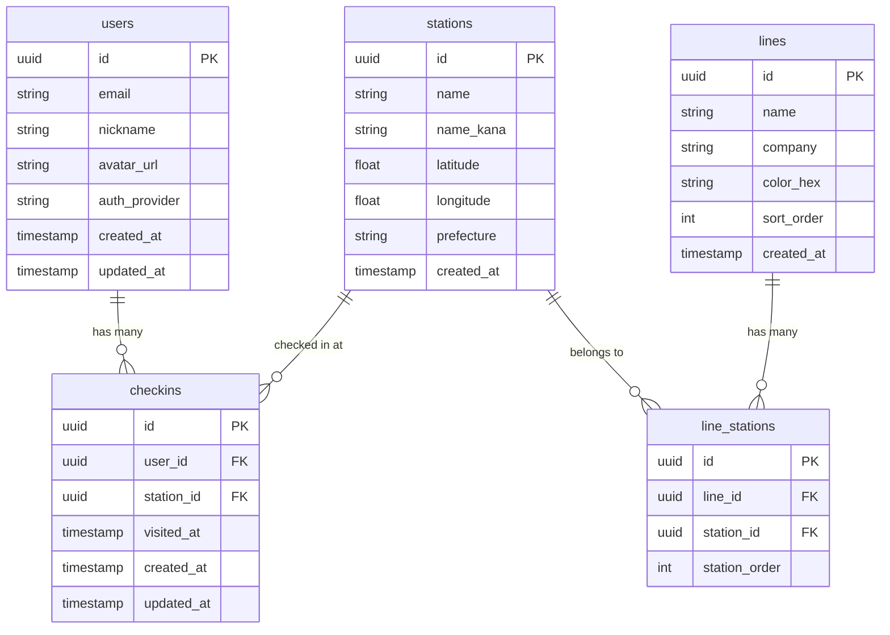

# EKICOMP DB設計書（Phase 1）

## ER図



---

## テーブル定義

### users（ユーザー）

| カラム | 型 | 制約 | 説明 |
|--------|------|------|------|
| id | uuid | PK, default: gen_random_uuid() | ユーザーID |
| email | varchar(255) | NOT NULL, UNIQUE | メールアドレス |
| nickname | varchar(50) | NOT NULL | 表示名 |
| avatar_url | text | NULLABLE | プロフィール画像URL |
| auth_provider | varchar(20) | NOT NULL | "google" or "apple" |
| created_at | timestamptz | NOT NULL, default: now() | 作成日時 |
| updated_at | timestamptz | NOT NULL, default: now() | 更新日時 |

**インデックス：**
- `idx_users_email` ON email

**備考：** Supabase Authの `auth.users` と連携。このテーブルはpublicスキーマに作成し、auth.usersのidと同じUUIDを使用する。

---

### stations（駅マスター）

| カラム | 型 | 制約 | 説明 |
|--------|------|------|------|
| id | uuid | PK, default: gen_random_uuid() | 駅ID |
| name | varchar(100) | NOT NULL | 駅名（例："渋谷"） |
| name_kana | varchar(200) | NOT NULL | 駅名カナ（例："シブヤ"） |
| latitude | double precision | NOT NULL | 緯度 |
| longitude | double precision | NOT NULL | 経度 |
| prefecture | varchar(10) | NOT NULL, default: '東京都' | 都道府県 |
| created_at | timestamptz | NOT NULL, default: now() | 作成日時 |

**インデックス：**
- `idx_stations_name` ON name
- `idx_stations_name_kana` ON name_kana
- `idx_stations_location` ON (latitude, longitude)

**備考：** 同名駅（例：「渋谷」でJR・メトロ・東急など）は1レコードとして管理。路線との紐づけはline_stationsで行う。

---

### lines（路線マスター）

| カラム | 型 | 制約 | 説明 |
|--------|------|------|------|
| id | uuid | PK, default: gen_random_uuid() | 路線ID |
| name | varchar(100) | NOT NULL | 路線名（例："山手線"） |
| company | varchar(100) | NOT NULL | 事業者名（例："JR東日本"） |
| color_hex | varchar(7) | NOT NULL | 路線カラー（例："#80C241"） |
| sort_order | integer | NOT NULL, default: 0 | 表示順 |
| created_at | timestamptz | NOT NULL, default: now() | 作成日時 |

**インデックス：**
- `idx_lines_company` ON company

---

### line_stations（路線-駅 中間テーブル）

| カラム | 型 | 制約 | 説明 |
|--------|------|------|------|
| id | uuid | PK, default: gen_random_uuid() | ID |
| line_id | uuid | FK → lines.id, NOT NULL | 路線ID |
| station_id | uuid | FK → stations.id, NOT NULL | 駅ID |
| station_order | integer | NOT NULL | 路線内での駅順序 |

**インデックス：**
- `idx_line_stations_line` ON line_id
- `idx_line_stations_station` ON station_id
- `uq_line_stations` UNIQUE ON (line_id, station_id)

---

### checkins（チェックイン）

| カラム | 型 | 制約 | 説明 |
|--------|------|------|------|
| id | uuid | PK, default: gen_random_uuid() | チェックインID |
| user_id | uuid | FK → users.id, NOT NULL | ユーザーID |
| station_id | uuid | FK → stations.id, NOT NULL | 駅ID |
| visited_at | timestamptz | NOT NULL, default: now() | 訪問日時 |
| created_at | timestamptz | NOT NULL, default: now() | 作成日時 |
| updated_at | timestamptz | NOT NULL, default: now() | 更新日時 |

**インデックス：**
- `idx_checkins_user` ON user_id
- `idx_checkins_station` ON station_id
- `idx_checkins_user_station` ON (user_id, station_id)
- `idx_checkins_visited_at` ON visited_at

**備考：** 同じ駅への複数回チェックインを許可（訪問履歴として記録）。進捗計算時はDISTINCTで集計。

---

## Supabase RLS（Row Level Security）ポリシー

```sql
-- users: 自分のレコードのみ読み書き可能
ALTER TABLE users ENABLE ROW LEVEL SECURITY;
CREATE POLICY "Users can view own profile" ON users FOR SELECT USING (auth.uid() = id);
CREATE POLICY "Users can update own profile" ON users FOR UPDATE USING (auth.uid() = id);

-- stations, lines, line_stations: 全ユーザー読み取り可、書き込み不可
ALTER TABLE stations ENABLE ROW LEVEL SECURITY;
CREATE POLICY "Stations are publicly readable" ON stations FOR SELECT USING (true);

ALTER TABLE lines ENABLE ROW LEVEL SECURITY;
CREATE POLICY "Lines are publicly readable" ON lines FOR SELECT USING (true);

ALTER TABLE line_stations ENABLE ROW LEVEL SECURITY;
CREATE POLICY "Line stations are publicly readable" ON line_stations FOR SELECT USING (true);

-- checkins: 自分のレコードのみ読み書き可能
ALTER TABLE checkins ENABLE ROW LEVEL SECURITY;
CREATE POLICY "Users can view own checkins" ON checkins FOR SELECT USING (auth.uid() = user_id);
CREATE POLICY "Users can create own checkins" ON checkins FOR INSERT WITH CHECK (auth.uid() = user_id);
CREATE POLICY "Users can update own checkins" ON checkins FOR UPDATE USING (auth.uid() = user_id);
CREATE POLICY "Users can delete own checkins" ON checkins FOR DELETE USING (auth.uid() = user_id);
```

---

## Phase 2以降で追加予定のテーブル

| テーブル | Phase | 概要 |
|----------|-------|------|
| checkin_photos | Phase 2 | チェックイン写真 |
| checkin_memos | Phase 2 | チェックインメモ |
| spots | Phase 2 | 駅紐づきスポット（居酒屋等） |
| badges | Phase 3 | バッジマスター |
| user_badges | Phase 3 | ユーザー獲得バッジ |
| friendships | Phase 4 | フレンド関係 |
| user_pairs | Phase 5 | パートナー連携 |
