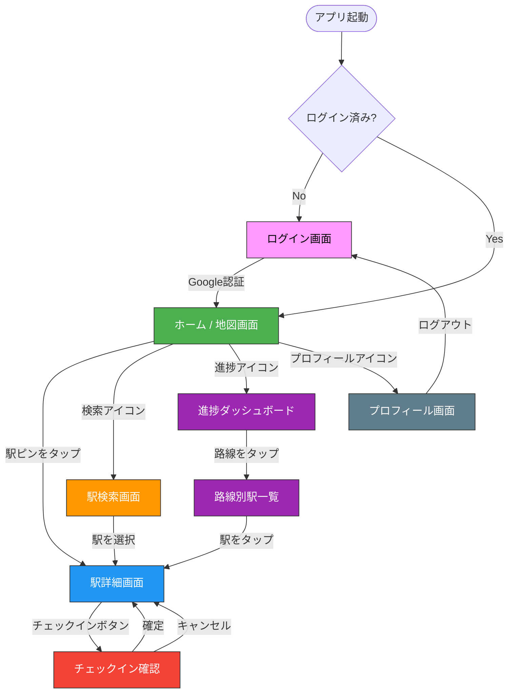

# EKICOMP 画面遷移図（Phase 1）

## 画面遷移図



---

## 各画面の概要

### ログイン画面
- アプリロゴ + キャッチコピー
- 「Googleでログイン」ボタン
- （Phase 2で「Appleでログイン」追加）

### ホーム / 地図画面（メイン画面）
- 東京都内の地図を全画面表示
- 全駅をピンで表示（訪問済み：カラー / 未訪問：グレー）
- 下部にナビゲーションバー：地図 | 検索 | 進捗 | プロフィール
- 右上に全体達成率のバッジ表示（例："23/487"）

### 駅検索画面
- テキスト入力で駅名検索（インクリメンタルサーチ）
- 路線でフィルタリング
- 検索結果リスト（駅名、路線名、訪問ステータス）

### 駅詳細画面
- 駅名、所属路線（カラーラベル）
- 訪問ステータス（未訪問 or 訪問済み + 日時）
- 「チェックイン」ボタン（未訪問 or 再訪問）
- 地図上での位置（小さなマップ）
- （Phase 2以降：メモ、写真、スポット一覧）

### チェックイン確認
- モーダル or ボトムシート
- 駅名の確認
- 訪問日時（デフォルト：現在、手動変更可）
- 「チェックイン！」確定ボタン
- 成功時：簡単なアニメーション + 地図のピンが色変わり

### 進捗ダッシュボード
- 全体達成率（大きな円グラフ or 数値）
- 路線別の達成率リスト（プログレスバー）
- 路線タップで駅一覧へ

### 路線別駅一覧
- 路線名 + 路線カラー
- 駅順に一覧表示（訪問済み：チェックマーク）
- 駅タップで駅詳細へ

### プロフィール画面
- ニックネーム、アイコン
- 総訪問駅数
- アカウント設定
- ログアウトボタン

---

## ナビゲーション構造

```
BottomNavigation
├── 地図（ホーム）     ← デフォルト表示
├── 検索
├── 進捗
└── プロフィール
```

---

## Phase 2以降で追加される画面

| 画面 | Phase | 概要 |
|------|-------|------|
| メモ・写真編集 | Phase 2 | チェックインに紐づくメモ・写真の追加編集 |
| スポット登録 | Phase 2 | 居酒屋等のスポット登録・編集 |
| バッジ一覧 | Phase 3 | 獲得済み/未獲得バッジの一覧 |
| ランダム提案 | Phase 3 | 「次どこ行く？」画面 |
| フレンド一覧 | Phase 4 | フレンド管理・ランキング |
| 共有マップ | Phase 5 | パートナーとの共有ビュー |
